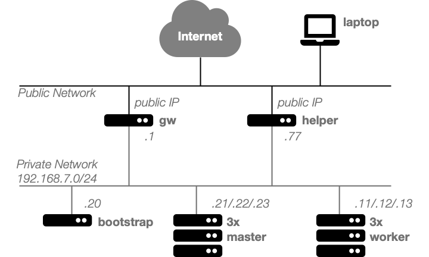

# OKD Demo

This demo will show you how to set up an OKD cluster on the [cloudscale.ch IaaS platform](https://www.cloudscale.ch/). OKD is the "Origin" community distribution of Kubernetes that powers Red Hat OpenShift.

## About

This demo shows a _mostly_ automated way to set up an OKD cluster. Some steps are intentionally not automated for demo purposes. However, it should be fairly easy to automate the remaining steps, if required.

For background information on the installation process please refer to [the official documentation](https://docs.okd.io/latest/installing/installing_bare_metal/installing-bare-metal.html).

### Target Audience

This demo is intended for:

 * Learning how to set up an OKD cluster on the cloudscale.ch IaaS platform.
 * Setting up an OKD test cluster.
 * Seeing Fedora CoreOS in action.
 * Learning about the cloudscale.ch IasS platform.

Please note that this demo setup is **not production ready**, since the services on the helper node present a single point of failure (see [Infrastructure](#Infrastructure)).

### Software Used

In this demo the following software packages and utilities are used:

 * **[OKD](https://www.okd.io):** the Kubernetes distribution that will be set up.
 * **[Ansible](https://www.ansible.com):** for automation.
 * **[ocp4-helpernode](https://github.com/RedHatOfficial/ocp4-helpernode):** Ansible playbook to set up services on helper node.
 * **[Fedora CoreOS](https://getfedora.org/en/coreos/):** the operating system installed on all cluster nodes.

### Infrastructure

The following diagram shows the infrastructure that is going to be set up during this demo. The default IP addresses are shown.



The following host types exist:

 * **laptop**: your computer, of course it does not have to be a laptop.
 * **helper** (CentOS): provides the following services:
    * load balancer (HAProxy)
    * DNS
    * web server for large Ignition files
 * **bootstrap** (Fedora CoreOS): temporary cluster bootstrap node, can be removed after cluster creation
 * **master** (Fedora CoreOS): cluster control plane nodes
 * **worker** (Fedora CoreOS): cluster worker nodes
 * **gw** (pfSense): serves as a NAT gateway for the cluster nodes. Allows cluster nodes to pull images.

## Prerequisites

Please make sure that the following requirements are fulfilled:

 * You have defined your `$CLUSTERID` and `$DOMAIN`
   * Examples for `$DOMAIN`: `example.org`, `me.name`
   * Examples for `$CLUSTERID`: `okd`, `test-cluster`

 * You have a cloudscale.ch account with sufficient account balance and an API token with read/write access (obtain it [here](https://control.cloudscale.ch/user/api-tokens))

 * The following commands are available in your `PATH` on your laptop:
    * `git`
    * `python3`

  * You have an SSH public/private key pair

    * Please note that Fedora CoreOS 33 has a [strong system-wide crypto policy](https://fedoraproject.org/wiki/Changes/StrongCryptoSettings2). You might want to create an Ed25519 key using `ssh-keygen -t ed25519` for this demo.

    * If you want to be able to log in to the cluster nodes, you'll need to add the key to a running `ssh-agent`

  * A pull secret from Red Hat (obtain it [here](https://cloud.redhat.com/openshift/install/crc/installer-provisioned), requires a Red Hat account)

## Run the Demo

During this demo shell commands need to be executed on a number of different hosts. For clarity a shell prompt indicating on which node and in which working directory a command needs to be executed is included in the instructions.

```
[user@host directory]#
```

### Set up Your Laptop

Download the demo code.

```
[you@laptop ~]# git clone https://github.com/cloudscale-ch/okd-demo
[you@laptop ~]# cd okd-demo
```

Set up the sub repositories.

```
[you@laptop okd-demo]# git submodule update --init
```

Create a Python virtual env to install Ansible and the latest version of the [cloudscale.ch Ansible collection](https://github.com/cloudscale-ch/ansible-collection-cloudscale).

```
[you@laptop okd-demo]# python3 -m venv venv
[you@laptop okd-demo]# . ./venv/bin/activate
(venv) [you@laptop okd-demo]# pip install -r requirements.txt
(venv) [you@laptop okd-demo]# ansible-galaxy collection install cloudscale_ch.cloud --force
```

Export the cloudscale.ch token for Ansible.

```
(venv) [you@laptop okd-demo]# export CLOUDSCALE_API_TOKEN=xxxx
```

### Set up Your Variables

Copy the default `vars.yml` and adapt it to your needs.

```
(venv) [you@laptop okd-demo]# cp defaults/vars.yml .
(venv) [you@laptop okd-demo]# vi vars.yml
```

At least the following variables are required and always need to be set:

 * `gw.password`: This password will be used to log in to the pfSense admin UI on your gateway.
 * `dns.domain`: Paste your `$DOMAIN` as value.
 * `dns.clusterid`: Paste your `$CLUSTERID` as value.
 * `pull_secret`: Paste your pull secret as value.
 * `ssh_key`: Paste your SSH public key as value.

 For all other variables the default values can be used. Please note that currently only `/24` network ranges are supported.

### Set up Helper Node and Gateway

Create the helper node and gateway using Ansible:

```
(venv) [you@laptop okd-demo]# ansible-playbook -e @vars.yml tasks/create-edge.yml
```

Open the pfSense web interface. To obtain the IP, access the [cloudscale.ch control panel](https://control.cloudscale.ch/server). Then enter `https://<<gw public IP>>` in your browser and configure the firewall. Note that securing access to the firewall appliance itself is not part of this demo, so keep that in mind if you want to use OKD in production.

In the admin UI do the following:

 1. Enable `Disable hardware checksum offload` in `System` > `Advanced` > `Networking` and click `Save`.

 2. Set `Outbound NAT Mode` to `Hybrid Outbound NAT ` in `Firewall` > `NAT` > `Outbound` and click `Save`.

 3. On the same screen add a mapping:

    1. Set the source network to `192.168.7.0/24` or your network range if you are using a non-default value.

    2. Click `Save` and `Apply Changes` on the next screen.

### Configure Services and Tools on the Helper Node

Run the following command to check if the Ansible inventory is working:

```
(venv) [you@laptop okd-demo]# ansible-inventory -i inventory-cloudscale.yml --graph
```

If the output contains the helper node and gateway you are good to continue.

Set up the services and tools on the helper node:
```
(venv) [you@laptop okd-demo]# ansible-playbook -i inventory-cloudscale.yml -e @vars.yml --user root --limit 'helper*' tasks/setup-helper.yml
```

Log in to the helper node (obtain the IP from the [cloudscale.ch control panel](https://control.cloudscale.ch/server)):

```
(venv) [you@laptop okd-demo]# ssh root@<<helper public IP>>
```

If you want you can check that the services are running. For example:

```
[root@helper ~]# dig bootstrap.$CLUSTERID.$DOMAIN
[root@helper ~]# curl http://192.168.7.77:8080/ignition/
```

### Create Ignition Config

An `install-config.yaml` was created for you on the helper node in `/root/okd/install-config.yaml`. If required you can adapt it. But normally the defaults are just fine.

```
[root@helper ~]# cd okd
[root@helper okd]# vi install-config.yaml
```

Create the Kubernetes manifests for the cluster using the OpenShift Installer:

```
[root@helper okd]# openshift-install create manifests
```

The `cluster-scheduler-02-config.yaml` manifest must be changed in order to
ensure no pods are being scheduled on the control plane nodes:

```
[root@helper okd]# vi manifests/cluster-scheduler-02-config.yml
```

Change the value of `mastersSchedulable` from `true` to `false`.

Create the Ignition files for the bootstrap, master and worker nodes.
```
[root@helper okd]# openshift-install create ignition-configs
```

```
[root@helper okd]# cp *.ign /var/www/html/ignition/
[root@helper okd]# chmod o+r /var/www/html/ignition/*.ign
```

### Bootstrapping the Cluster Nodes

On your laptop run the following playbook to create the master and worker nodes:

```
(venv) [you@laptop okd-demo]# ansible-playbook -e @vars.yml tasks/create-nodes.yml
```

On the helper, run the following command which blocks until the bootstrap process has finished:

```
[root@helper okd]# openshift-install wait-for bootstrap-complete --log-level debug
```

The bootstrapping process takes approx. 20 minutes. It's best to grab a coffee during this time. But if you want to follow the progress there are a number of options:

 * Open the VNC Console in the [cloudscale.ch control panel](https://control.cloudscale.ch/server). You'll notice that all cluster nodes perform a reboot during the bootstrap process.

 * Point your browser to the HAProxy statistics report at `http://<<helper public IP>>:9000`. You'll notice that the rows for the bootstrap and master nodes change between red and green. The bootstrap process is finished once all masters are green and the bootstrap node is red.

 * Log in to the bootstrap node and follow the log (requires SSH key forwarding):
   ```
   [root@helper ~]# ssh core@bootstrap
   [core@bootstrap ~]$ journalctl -b -f -u release-image.service -u bootkube.service
   ```

The bootstrap node can be deleted after the bootstrap process has finished.

### Finish Install

All the steps specific to the `cloudscale.ch` infrastructure are now completed. Please follow [these instructions](https://github.com/RedHatOfficial/ocp4-helpernode/blob/1ac7f276b537cd734240eda9ed554a254ba80629/docs/quickstart.md#finish-install) to complete the installation. All commands are executed on the helper node. Note that the `ocp4` directory is called `okd` in this demo.
